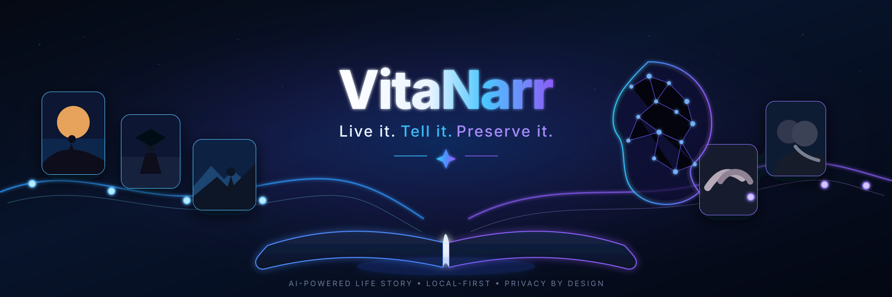
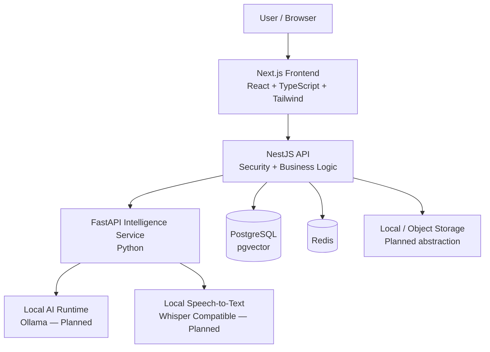
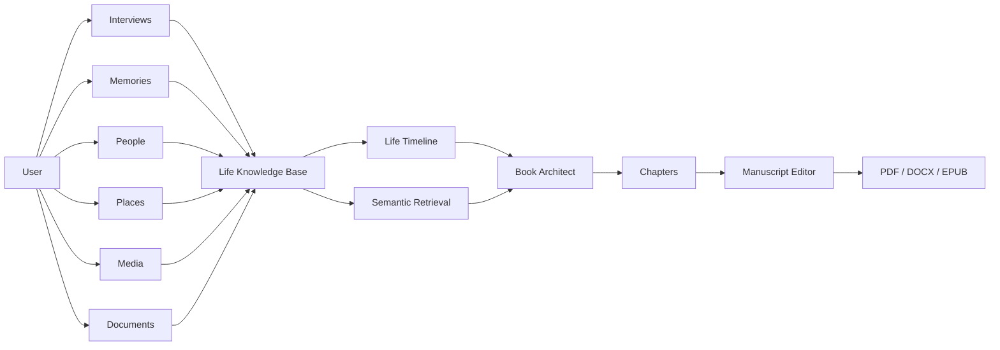
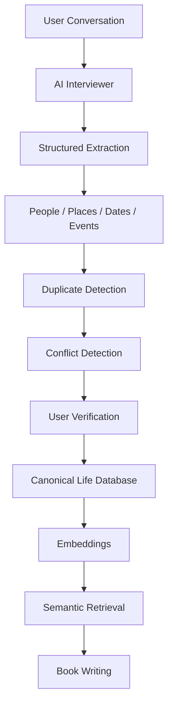

<div align="center">

<!-- Replace this path with your final repository banner -->


<br />

# VitaNarr

### Live it. Tell it. Preserve it.

**A local-first, privacy-focused AI platform for preserving a human life as memories, stories, timelines, and eventually a professionally written autobiography.**

<br />

[](https://nextjs.org/)
[](https://nestjs.com/)
[](https://fastapi.tiangolo.com/)
[](https://www.postgresql.org/)
[](https://redis.io/)
[](https://www.docker.com/)

<br />


<br />

**Private by design · Local AI ready · Structured memory · Human-approved truth**

</div>

---

## ✦ What is VitaNarr?

**VitaNarr** is an AI-powered autobiography and life-story platform designed to help people preserve their lives through conversations, memories, documents, photographs, timelines, and eventually professionally written books.

Instead of asking an AI model to simply *“write my autobiography,”* VitaNarr is being designed around a much stronger principle:

> **Build the truth first. Write the story second.**

The platform will gradually create a structured representation of a person's life and use only approved or traceable information when generating narrative content.

The long-term objective is to transform:

```text
Conversations
     +
Memories
     +
People
     +
Places
     +
Photos
     +
Documents
     +
Life Events
     ↓
Structured Personal Knowledge
     ↓
Verified Timeline
     ↓
AI-assisted Storytelling
     ↓
Professional Autobiography
     ↓
PDF · DOCX · EPUB · Print
```

---

## ✦ Core Principle

### AI should help tell your story — not invent it.

VitaNarr is being designed around **biographical integrity**.

The future AI layer must never silently manufacture:

- people
- achievements
- relationships
- locations
- quotations
- conversations
- dates
- events
- education history
- career history
- life experiences

AI will be allowed to improve:

- structure
- grammar
- readability
- transitions
- narrative flow
- chapter organization
- literary quality

But the underlying life facts must remain traceable to the user or another approved source.

---

# ✦ Vision

Imagine opening VitaNarr and saying:

> “Today I want to tell you about my university years.”

The system listens.

It asks meaningful follow-up questions.

It identifies:

```text
People
Places
Dates
Projects
Achievements
Failures
Turning points
Emotions
Lessons
```

It stores them as structured memories.

Later you say:

> “Write the chapter about my university journey.”

VitaNarr retrieves only the relevant information, builds an outline, creates a chapter draft, links it back to its sources, and asks you to review it.

Over time, hundreds of memories can become an entire book.

---

# ✦ Architecture



### Trust Boundary

The **NestJS API is the primary security and business-logic boundary**.

The browser does **not** communicate directly with:

```text
PostgreSQL
Redis
Python intelligence services
Local AI models
Internal storage
```

All protected operations flow through the application API.

---

# ✦ Current Engineering Status

VitaNarr is currently in its **foundation phase**.

The repository provides the production-oriented engineering base required for the future product.

Core autobiography features have intentionally **not** been rushed into the codebase before the architecture is stable.

| System | Technology | Status |
|---|---|---|
| Frontend | Next.js + React + TypeScript + Tailwind | ✅ Foundation implemented |
| Main API | NestJS + TypeScript | ✅ Foundation implemented |
| Security middleware | Helmet | ✅ Implemented |
| API logging | Pino | ✅ Implemented |
| Intelligence service | FastAPI + Python 3.13 | ✅ Foundation implemented |
| Python tooling | uv | ✅ Implemented |
| Database | PostgreSQL | ✅ Infrastructure implemented |
| Vector support | pgvector | ✅ Infrastructure available |
| ORM | Drizzle ORM | ✅ Foundation implemented |
| Cache | Redis | ✅ Infrastructure implemented |
| Background jobs | BullMQ | ⏳ Planned |
| Local AI | Ollama | ⏳ Planned |
| Primary local model | Qwen3 | ⏳ Planned |
| Speech-to-text | Local Whisper-compatible engine | ⏳ Planned |
| Authentication | — | ⏳ Planned |
| Users / profiles | — | ⏳ Planned |
| Memories | — | ⏳ Planned |
| Life events | — | ⏳ Planned |
| Interviews | — | ⏳ Planned |
| Timeline | — | ⏳ Planned |
| Embeddings | — | ⏳ Planned |
| RAG | — | ⏳ Planned |
| Book generation | — | ⏳ Planned |
| Publishing | — | ⏳ Planned |

> The README intentionally distinguishes **implemented**, **infrastructure-ready**, and **planned** functionality.

---

# ✦ Technology Stack

## Frontend

```text
Next.js
React
TypeScript
Tailwind CSS
```

Responsible for:

- application interface
- dashboards
- life timeline
- interview experience
- manuscript editor
- memory management
- book preview
- publishing workflow

---

## Main Backend

```text
NestJS
TypeScript
Helmet
Pino
```

Responsible for:

- authentication
- authorization
- business logic
- validation
- user ownership
- persistence orchestration
- AI-service communication
- job creation
- secure file access

---

## Intelligence Service

```text
FastAPI
Python 3.13
uv
```

The Python service will eventually handle AI-oriented workloads such as:

- language-model integration
- structured memory extraction
- embeddings
- retrieval pipelines
- speech transcription
- document intelligence
- AI evaluation
- consistency analysis

The application API remains the primary public backend boundary.

---

## Data Layer

```text
PostgreSQL
pgvector
Drizzle ORM
```

PostgreSQL will act as the canonical source of truth for structured life information.

Planned domains include:

```text
Users
Profiles
People
Places
Memories
Life Events
Interviews
Documents
Media
Books
Chapters
Sources
Versions
Publishing metadata
```

`pgvector` will support future semantic memory retrieval without requiring a separate vector database during the initial architecture.

---

## Cache & Background Processing

```text
Redis
BullMQ — planned
```

Future background tasks may include:

- transcription
- document processing
- memory extraction
- embedding generation
- chapter generation
- consistency analysis
- book compilation

---

## Local Artificial Intelligence

The project is designed around a **local-first AI architecture**.

Planned local runtime:

```text
Ollama
   ↓
Qwen3
```

The model configuration will remain environment-driven so that model providers can eventually be replaced without rewriting business logic.

Future architecture:

```text
LLMProvider
├── OllamaProvider
├── OpenAIProvider
├── AnthropicProvider
└── GeminiProvider
```

Only the local provider is part of the initial product direction.

---

# ✦ Repository Structure

```text
VitaNarr/
│
├── frontend/
│   └── Next.js browser application
│
├── backend/
│   │
│   ├── api/
│   │   └── NestJS application API
│   │
│   └── intelligence/
│       └── FastAPI intelligence service
│
├── shared/
│   └── contracts/
│       └── Shared TypeScript contracts
│
├── infrastructure/
│   └── docker/
│       └── Local container initialization
│
├── storage/
│   └── Local runtime data
│
├── docs/
│   ├── architecture.md
│   └── development.md
│
├── .env.example
├── docker-compose.yml
├── package.json
├── pnpm-workspace.yaml
└── README.md
```

---

# ✦ Planned Product Domains



---

# ✦ Future Memory Pipeline

The future interview system will not treat conversations as disposable chat history.



---

# ✦ Provenance-First Design

A future VitaNarr claim might look conceptually like this:

```text
Claim
────────────────────────────────────────
"I began university in September 2022."

Evidence
────────────────────────────────────────
✓ Interview session #12
✓ Uploaded admission document

Verification
────────────────────────────────────────
Status: Verified
Confidence: High
```

If information conflicts:

```text
Memory A
Started university in September 2022

Memory B
Started university in October 2022

Result
Needs user confirmation
```

VitaNarr should resolve uncertainty instead of silently creating false certainty.

---

# ✦ Privacy-First Philosophy

Life stories contain deeply personal information.

Privacy therefore cannot be treated as an optional feature.

The architecture is being designed around:

```text
Local AI
Local transcription
Strict ownership boundaries
Minimal external dependencies
No direct browser-to-database access
Controlled file handling
Explicit publication approval
```

Future security requirements include:

- secure password hashing
- resource ownership validation
- authorization on all private routes
- secure file handling
- upload validation
- rate limiting
- request validation
- sensitive-log filtering
- prompt-injection defenses
- cross-user isolation
- safe AI context handling

---

# ✦ Local-First Philosophy

VitaNarr is intentionally being designed to operate without mandatory paid AI APIs.

Development targets:

```text
AI API cost       → 0
Database API cost → 0
Vector DB cost    → 0
Speech API cost   → 0
```

Local development can eventually use:

```text
Ollama
Qwen3
PostgreSQL
pgvector
Redis
Whisper-compatible STT
Docker
```

Cloud infrastructure can be introduced later when deployment scale requires it.

---

# ✦ System Requirements

Recommended development environment:

| Requirement | Version |
|---|---|
| Operating System | Windows 11 |
| Shell | PowerShell |
| Node.js | 24 |
| pnpm | 11 |
| Python | 3.13 |
| Python environment manager | uv |
| Docker | Docker Desktop |
| Docker Compose | Required |

---

# ✦ Installation

Clone the repository:

```powershell
git clone <YOUR_REPOSITORY_URL>
cd vitanarr
```

Install JavaScript dependencies:

```powershell
pnpm install
```

Install Python dependencies:

```powershell
uv sync --project backend\intelligence
```

Create environment files:

```powershell
Copy-Item .env.example .env

Copy-Item frontend\.env.example frontend\.env.local

Copy-Item backend\api\.env.example backend\api\.env

Copy-Item backend\intelligence\.env.example backend\intelligence\.env
```

Update private environment values where required.

> Never commit private `.env` files.

---

# ✦ Development

Start infrastructure:

```powershell
pnpm docker:up
```

Start the complete development environment:

```powershell
pnpm dev
```

---

## Run Services Individually

Frontend:

```powershell
pnpm dev:frontend
```

NestJS API:

```powershell
pnpm dev:api
```

Python intelligence service:

```powershell
pnpm dev:intelligence
```

---

# ✦ Local Services

| Service | Address |
|---|---|
| Frontend | `http://localhost:3000` |
| API | `http://localhost:4000/api` |
| API Health | `http://localhost:4000/api/health` |
| Intelligence Service | `http://127.0.0.1:8001` |
| Intelligence Health | `http://127.0.0.1:8001/health` |
| PostgreSQL | `localhost:5432` |
| Redis | `localhost:6379` |

---

# ✦ Validation

Before considering engineering work complete, run the validation suite.

### JavaScript / TypeScript

```powershell
pnpm lint
pnpm typecheck
pnpm test
pnpm build
pnpm format:check
```

### Python

```powershell
uv run --project backend\intelligence python -m pytest -v
```

```powershell
uv run --project backend\intelligence mypy backend\intelligence\app
```

```powershell
uv run --project backend\intelligence ruff check backend\intelligence
```

### Docker

```powershell
docker compose config
docker compose ps
```

---

# ✦ Engineering Quality Gate

A development phase should not be marked complete unless:

```text
✓ Typecheck passes
✓ Lint passes
✓ Tests pass
✓ Production build passes
✓ Relevant integration tests pass
✓ No known blocker is hidden
```

The project follows a simple rule:

> **Implemented means implemented and verified — not merely planned.**

---

# ✦ Development Roadmap

```text
Phase 0
Repository Foundation
        ↓
Phase 1
Authentication
        ↓
Phase 2
Core Life Database
        ↓
Phase 3
Timeline
        ↓
Phase 4
Local AI Integration
        ↓
Phase 5
AI Interviewer
        ↓
Phase 6
Memory Extraction
        ↓
Phase 7
Embeddings + Retrieval
        ↓
Phase 8
Book Architecture
        ↓
Phase 9
Chapter Generation
        ↓
Phase 10
Book Editor
        ↓
Phase 11
Voice Interviews
        ↓
Phase 12
Media + Documents
        ↓
Phase 13
Book Compilation
        ↓
Phase 14
Publishing Preparation
        ↓
Phase 15
Security + Production Hardening
```

---

## Phase 0 — Foundation

```text
✅ Repository architecture
✅ Next.js foundation
✅ NestJS API foundation
✅ FastAPI intelligence service
✅ TypeScript configuration
✅ Python environment
✅ PostgreSQL
✅ pgvector infrastructure
✅ Redis
✅ Drizzle foundation
✅ Docker Compose
✅ Environment configuration
✅ Logging foundation
✅ Validation tooling
✅ Testing foundation
```

---

## Phase 1 — Authentication

Planned:

```text
User registration
Login
Logout
Password hashing
Session / token architecture
Protected API routes
User profiles
Ownership boundaries
```

---

## Phase 2 — Life Knowledge Base

Planned:

```text
People
Places
Life events
Memories
CRUD operations
Verification states
Ownership protection
```

---

## Phase 3 — Life Timeline

Planned:

```text
Chronological timeline
Approximate dates
Date ranges
Unknown dates
Categories
Filters
Editing
```

---

## Phase 4 — Local AI

Planned:

```text
Ollama provider
Qwen3
Streaming
Structured output
Schema validation
Timeout handling
Retries
Health checks
```

---

## Phase 5 — AI Interviewer

Planned:

```text
Interview sessions
Adaptive questioning
Context awareness
Interview history
Follow-up questions
Transcript persistence
```

---

## Phase 6 — Memory Intelligence

Planned extraction:

```text
People
Places
Dates
Life events
Projects
Quotes
Relationships
Achievements
Turning points
```

Extracted memories must remain unverified until appropriate validation occurs.

---

## Phase 7 — Retrieval & RAG

Planned:

```text
Embeddings
pgvector
Semantic search
Relational filtering
Hybrid retrieval
Context construction
```

---

## Phase 8 — Book Architecture

Planned:

```text
Books
Parts
Chapters
Outline generation
Book structure
User-controlled ordering
```

---

## Phase 9 — Chapter Generation

Planned pipeline:

```text
Relevant memories
       ↓
Relevant events
       ↓
People + places
       ↓
Chapter outline
       ↓
Draft generation
       ↓
Consistency check
       ↓
Source validation
       ↓
Human review
```

---

## Phase 10 — Manuscript Editor

Planned:

```text
Rich text editing
Autosave
Version history
Chapter status
Source panel
AI rewrite tools
Word count
Restore versions
```

---

## Phase 11 — Voice

Planned:

```text
Microphone
   ↓
Local recording
   ↓
Local transcription
   ↓
Transcript
   ↓
Memory extraction
   ↓
Human verification
```

---

## Phase 12 — Media & Documents

Planned support:

```text
Images
Audio
Video
PDF
DOCX
TXT
Markdown
```

---

## Phase 13 — Book Compilation

Planned export formats:

```text
PDF
DOCX
EPUB
```

Potential manuscript sections:

```text
Title Page
Copyright
Dedication
Acknowledgements
Table of Contents
Prologue
Parts
Chapters
Photographs
Captions
Epilogue
Author Biography
```

---

## Phase 14 — Publishing Preparation

Potential publishing targets:

```text
Amazon KDP
IngramSpark
Personal websites
Private family editions
Digital downloads
```

External publication must always require explicit human approval.

---

## Phase 15 — Production Hardening

Planned:

```text
Authorization audit
Privacy audit
Prompt-injection testing
Upload security
Rate limiting
AI failure handling
Observability
Performance testing
Regression suite
```

---

# ✦ Planned User Experience

The finished product is intended to feel more like a premium writing studio than an administration panel.

```text
Dashboard
│
├── My Life
│   ├── Timeline
│   ├── Memories
│   ├── People
│   ├── Places
│   ├── Photos
│   └── Documents
│
├── Interviews
│   ├── Start Interview
│   └── Interview History
│
├── My Book
│   ├── Overview
│   ├── Structure
│   ├── Chapters
│   ├── Sources
│   └── Preview
│
├── Publish
│   ├── Metadata
│   ├── Cover
│   ├── Export
│   └── Publishing Checklist
│
└── Settings
```

Potential dashboard:

```text
┌───────────────────────────────────────────────────┐
│                                                   │
│                 YOUR STORY                        │
│                                                   │
│  142 Memories     38 Events       21 People       │
│                                                   │
│  8 Chapters       43,280 Words                    │
│                                                   │
├───────────────────────────────────────────────────┤
│                                                   │
│  Continue your interview                          │
│  Continue writing Chapter 4                       │
│  Review 6 extracted memories                      │
│                                                   │
└───────────────────────────────────────────────────┘
```

---

# ✦ Book Possibilities

A single VitaNarr life knowledge base could eventually create multiple forms of personal literature.

```text
One Life Database
       │
       ├── Full Autobiography
       │
       ├── Career Memoir
       │
       ├── Family History
       │
       ├── Childhood Stories
       │
       ├── Lessons From My Life
       │
       ├── Founder Story
       │
       └── Private Family Edition
```

---

# ✦ Future Example

```text
User:
"I started becoming interested in programming while I was at university."

VitaNarr:
"What first sparked your interest — a class, a project,
someone you met, or something you explored yourself?"

User:
"It started when I began building my own projects."

VitaNarr extracts:

Event:
Interest in software development began during university.

Related topic:
Personal projects

Verification:
Needs review
```

Only after confirmation does the information become part of the canonical life record.

---

# ✦ Documentation

Project documentation lives under:

```text
docs/
```

Important guides:

- [`docs/architecture.md`](docs/architecture.md)
- [`docs/development.md`](docs/development.md)

---

# ✦ Development Principles

VitaNarr follows several non-negotiable engineering principles.

### 01 — Truth before prose

Narrative quality must never justify invented biography.

### 02 — Human approval

The user remains the final authority over their life story.

### 03 — Privacy by design

Personal memories deserve stronger protections than ordinary application data.

### 04 — Local-first AI

Core development should not require paid model APIs.

### 05 — Provider independence

AI providers should remain replaceable.

### 06 — Traceability

Important generated content should be connected back to its source.

### 07 — Incremental engineering

Large systems are built phase by phase, with validation after every phase.

### 08 — No fake completion

A feature is not complete until it exists and its required tests pass.

---

# ✦ Why VitaNarr?

Most AI writing products start with:

```text
Prompt → AI → Text
```

VitaNarr is being designed around:

```text
Human Life
    ↓
Evidence
    ↓
Structured Memory
    ↓
Verification
    ↓
Retrieval
    ↓
Story Architecture
    ↓
AI-Assisted Writing
    ↓
Human Approval
    ↓
Book
```

That difference is the foundation of the project.

---

# ✦ Project Philosophy

> Your life is not a prompt.

> It is thousands of people, places, decisions, failures, achievements, emotions, relationships, memories, and turning points.

VitaNarr exists to preserve those experiences carefully enough that they can still be understood decades later.

---

<div align="center">

## VitaNarr

### Live it. Tell it. Preserve it.

**Build the memory. Preserve the truth. Tell the story.**

<br />

`Next.js` · `NestJS` · `FastAPI` · `PostgreSQL` · `pgvector` · `Redis` · `Ollama`

<br />

**Local-first AI autobiography platform**

</div>
